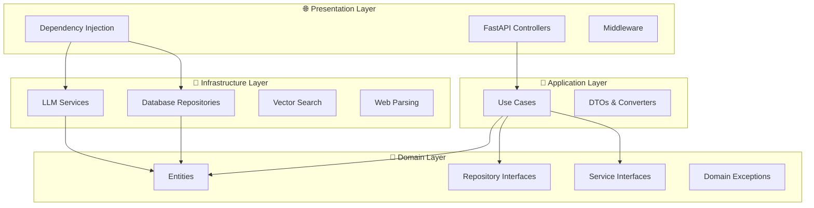

## ➡️ [ссылка для проверяющего ТЗ. (Описание тестового задания)](docs/DESCRIPTION.md) ⬅️

# 🤖 EORA AI Q&A Service

> Интеллектуальный сервис вопросов и ответов с векторным поиском для корпоративной базы знаний EORA

**AI-powered question-answering service** построенный на принципах **Clean Architecture** и **SOLID**, использующий семантический поиск с pgvector и LLM для генерации контекстных ответов на основе корпоративных знаний компании EORA.

[](https://python.org)
[](https://fastapi.tiangolo.com)
[](https://postgresql.org)
[](https://blog.cleancoder.com/uncle-bob/2012/08/13/the-clean-architecture.html)

## ✨ Ключевые возможности

### 🧠 Интеллектуальная обработка
- **🤖 AI-powered Q&A**: Генерация контекстных ответов с помощью Anthropic Claude
- **🔍 Векторный поиск**: Семантический поиск релевантных источников с pgvector
- **📚 База знаний**: Автоматическое создание корпоративной базы знаний из веб-источников
- **🎯 Контекстные ответы**: Ответы с ссылками на релевантные кейсы и проекты

### 🏗️ Архитектурные преимущества
- **Clean Architecture**: Четкое разделение на слои с правильными зависимостями
- **SOLID принципы**: Код легко тестируется, расширяется и поддерживается
- **Dependency Injection**: Слабая связанность компонентов
- **Domain-Driven Design**: Богатые доменные модели и сервисы

### 🚀 Технические возможности
- **Асинхронная обработка**: Высокая производительность с async/await
- **Автоматические эмбеддинги**: Создание векторных представлений контента
- **Масштабируемость**: Готовность к горизонтальному масштабированию
- **Мониторинг**: Комплексное логирование и обработка ошибок

## �️ Архитектура системы

Проект реализует **Clean Architecture** с четким разделением ответственности:



### 📁 Структура проекта

```
src/
├── 💎 domain/                 # Доменный слой (бизнес-логика)
│   ├── entities/             # Сущности: Question, Answer, Source
│   ├── repositories/         # Интерфейсы репозиториев
│   ├── services/            # Интерфейсы доменных сервисов
│   └── exceptions/          # Доменные исключения
├── 🎯 application/           # Слой приложения (use cases)
│   ├── use_cases/           # Бизнес-сценарии
│   └── dto/                 # Объекты передачи данных
├── 🔧 infrastructure/        # Инфраструктурный слой
│   ├── database/            # SQLAlchemy модели и подключения
│   ├── repositories/        # Реализации репозиториев
│   └── services/            # Внешние сервисы (LLM, парсинг)
├── 🌐 presentation/          # Слой представления (API)
│   ├── api/                 # REST контроллеры
│   ├── dependencies/        # Внедрение зависимостей
│   └── setup/               # Настройка приложения
└── ⚙️ core/                  # Общие утилиты
    ├── config/              # Конфигурация
    ├── logging/             # Логирование
    └── middleware/          # Middleware
```

### 🔄 Основные Use Cases

1. **AskQuestionUseCase**: Обработка вопроса пользователя
   - Создание вопроса → Поиск источников → Генерация ответа
2. **LoadSourcesUseCase**: Загрузка и обработка источников
   - Парсинг URL → Сохранение → Создание эмбеддингов
3. **FindRelevantSourcesUseCase**: Поиск релевантных источников
4. **GenerateAnswerUseCase**: Генерация ответа с помощью LLM


## 🛠️ Технологический стек

### 🚀 Основные технологии
- **Backend Framework**: [FastAPI](https://fastapi.tiangolo.com/) - современный, быстрый веб-фреймворк
- **Language**: Python 3.12+ с полной типизацией
- **Database**: PostgreSQL 15+ с расширением [pgvector](https://github.com/pgvector/pgvector)
- **ORM**: SQLAlchemy 2.0+ (async) с Alembic для миграций

### 🤖 AI & Machine Learning
- **LLM Provider**: [Anthropic Claude](https://www.anthropic.com/) API
- **Embeddings**: [SentenceTransformers](https://www.sbert.net/) для векторизации текста
- **Vector Search**: pgvector для семантического поиска
- **Text Processing**: BeautifulSoup4 для парсинга веб-контента

### 🏗️ Архитектурные компоненты
- **Validation**: Pydantic для валидации данных и настроек
- **HTTP Client**: httpx для асинхронных HTTP-запросов
- **Dependency Injection**: FastAPI Depends для IoC
- **Logging**: Структурированное логирование с ротацией

### 🐳 DevOps & Tools
- **Containerization**: Docker & Docker Compose
- **Package Manager**: [uv](https://github.com/astral-sh/uv) - быстрый Python package manager
- **Code Quality**: Ruff (форматирование), MyPy (типы), Pre-commit hooks
- **Development**: Hot reload, автоматические миграции, swagger docs

### 🔧 Архитектурные паттерны
- **Clean Architecture** с правильными зависимостями
- **Repository Pattern** для абстракции данных
- **Dependency Injection** для тестируемости
- **CQRS-подобное разделение** use cases
- **Domain-Driven Design** принципы

## 📋 Системные требования

### ✅ Обязательные компоненты
- **Python**: 3.12 или выше
- **Docker**: Последняя версия с Docker Compose
- **API Key**: Ключ Anthropic API ([получить здесь](https://console.anthropic.com/))
- **Memory**: Минимум 4GB RAM (рекомендуется 8GB)
- **Disk**: 2GB свободного места

### 🔧 Автоматически устанавливаемые
- **uv**: Package manager (устанавливается автоматически)
- **PostgreSQL**: Запускается в Docker контейнере
- **pgvector**: Расширение для векторного поиска

> **⚠️ Важно**: Убедитесь, что Docker запущен перед началом установки. Порты 5432 (PostgreSQL) и 8000 (API) должны быть свободны.

## ⚙️ Установка и настройка

### 🚀 Быстрый старт с Makefile

1. **Клонируйте репозиторий**
```bash
git clone git@github.com:maratumerow/ai-question-and-answer-service-EORA.git
cd ai-question-and-answer-service-EORA
```

2. **Убедитесь, что Docker запущен**
```bash
docker --version
docker-compose --version
```

3. **Запустите полную настройку одной командой**
```bash
cd scripts && make setup
```

**Что делает `make setup`:**
- Создает Python виртуальное окружение
- Устанавливает все зависимости
- Копирует `.env.example` в `.env` (если не существует)
- **Автоматически запускает PostgreSQL в Docker**
- Ожидает готовности базы данных
- Применяет все миграции базы данных

4. **Отредактируйте .env файл** с вашими настройками (обязательно укажите ANTHROPIC_API_KEY)

5. **Запустите приложение**
```bash
make run
```

6. **Когда закончите работу**, остановите сервисы
```bash
make docker-down
```

> **Примечание**: Все команды Makefile находятся в папке `scripts/`. После setup доступны команды: `make run`, `make check`, `make docker-setup`, `make docker-up` и другие.

### 🐳 Альтернативный способ: Полное развертывание в Docker

Если вы предпочитаете запустить все приложение в Docker:

```bash
cd scripts
make docker-setup  # Настройка окружения
make docker-up     # Запуск всех сервисов в Docker
```

### 🛠️ Ручная установка (без Makefile)

<details>
<summary>Развернуть инструкции по ручной установке</summary>

1. **Создайте виртуальное окружение**
```bash
uv venv
uv sync
```

2. **Настройте переменные окружения**
```bash
cp config/.env.example .env
# Отредактируйте .env файл
```

3. **Запустите PostgreSQL**
```bash
docker-compose -f docker/docker-compose.yml up -d postgres
```

4. **Примените миграции**
```bash
uv run alembic upgrade head
```

5. **Запустите приложение**
```bash
uv run uvicorn src.main:app --reload --host 0.0.0.0 --port 8000
```

</details>


## 🎯 Использование API

Сервис предоставляет RESTful API для управления базой знаний и получения ответов на вопросы.

### 📊 Health Check
Проверка состояния сервиса:
```bash
curl http://localhost:8000/api/v1/health/
```

### 📚 Загрузка источников в базу знаний

Загрузите веб-страницы для создания корпоративной базы знаний:

```bash
curl -X POST "http://localhost:8000/api/v1/sources/load" \
     -H "Content-Type: application/json" \
     -d '{
       "urls": [
         "https://eora.ru/cases/kazanexpress-sistema-rekomendacij-na-sajte",
         "https://eora.ru/cases/dodo-pizza-robot-analitik-otzyvov",
         "https://eora.ru/cases/lamoda-systema-segmentacii-i-poiska-po-pohozhey-odezhde"
       ]
     }'
```

**Что происходит при загрузке:**
1. 🌐 Парсинг содержимого веб-страниц
2. 🔄 Разбиение текста на семантические блоки
3. 🧠 Создание векторных эмбеддингов
4. 💾 Сохранение в PostgreSQL с pgvector

### ❓ Задать вопрос и получить ответ

Получите интеллектуальный ответ на основе загруженных источников:

```bash
curl -X POST "http://localhost:8000/api/v1/questions/ask" \
     -H "Content-Type: application/json" \
     -d '{
       "question": "Какие проекты по системам рекомендаций реализовала EORA?"
     }'
```

**Как работает генерация ответов:**
1. 🔍 Векторный поиск релевантных источников
2. 🎯 Фильтрация по порогу семантического сходства
3. 🤖 Генерация контекстного ответа с помощью Claude
4. 📝 Форматирование с прямыми ссылками на источники

### 📊 Пример ответа

```json
{
  "question": {
    "id": "123e4567-e89b-12d3-a456-426614174000",
    "text": "Какие проекты по системам рекомендаций реализовала EORA?",
    "created_at": "2025-01-15T10:30:00Z"
  },
  "answer": {
    "id": "987fcdeb-51a2-43d1-9c4f-426614174000",
    "text": "EORA реализовала несколько проектов по системам рекомендаций:\n\n• Система рекомендаций KazanExpress: https://eora.ru/cases/kazanexpress-sistema-rekomendacij-na-sajte - персональные рекомендации товаров для интернет-магазина...",
    "processing_time_ms": 1250,
    "created_at": "2025-01-15T10:30:01Z"
  }
}
```

### 📖 Интерактивная документация

- **Swagger UI**: [http://localhost:8000/docs](http://localhost:8000/docs)
- **ReDoc**: [http://localhost:8000/redoc](http://localhost:8000/redoc)

### 🔍 Параметры векторного поиска

Система использует следующие настройки для поиска релевантных источников:
- **Модель эмбеддингов**: `sentence-transformers/all-MiniLM-L6-v2`
- **Размер чанка**: 200 слов с перекрытием 20 слов
- **Порог сходства**: 0.7 (70% семантического сходства)
- **Максимум источников**: 5 наиболее релевантных

Эти параметры можно настроить в конфигурации (`src/core/config/vector_search.py`).

## 🚨 Устранение неполадок

### 🐳 Проблемы с Docker и базой данных

**❌ "could not connect to server: Connection refused"**
```bash
# Проверить статус Docker
docker --version
docker ps

# Проверить занятость порта PostgreSQL
lsof -i :5432

# Перезапустить setup
cd scripts && make docker-down && make setup
```

**⏱️ "timeout waiting for PostgreSQL"**
```bash
# Запустить PostgreSQL вручную и подождать
docker-compose -f docker/docker-compose.yml up -d postgres
sleep 60  # Подождать минуту
cd scripts && make setup
```

**🔌 Проблемы с портами**
- **5432**: PostgreSQL (убедитесь, что порт свободен)
- **8000**: FastAPI приложение
```bash
# Найти процессы на портах
sudo lsof -i :5432
sudo lsof -i :8000

# Освободить порт (если нужно)
sudo kill -9 <PID>
```

### 🤖 Проблемы с API и LLM

**🔑 "ANTHROPIC_API_KEY environment variable is required"**
```bash
# Проверить наличие ключа в .env
cat .env | grep ANTHROPIC_API_KEY

# Добавить ключ в .env файл
echo "ANTHROPIC_API_KEY=your_key_here" >> .env
```

**🌐 Ошибки при загрузке источников**
```bash
# Проверить логи приложения
tail -f logs/eora_errors.log

# Проверить доступность URL
curl -I https://eora.ru/cases/some-case

# Проверить статус базы данных
docker exec -it postgres_container psql -U user -d database -c "SELECT COUNT(*) FROM sources;"
```

### 🔧 Проблемы разработки

**📦 Проблемы с зависимостями**
```bash
# Очистить кеш uv
uv cache clean

# Переустановить зависимости
rm -rf .venv
uv venv
uv sync
```

**🔄 Проблемы с миграциями**
```bash
# Проверить статус миграций
uv run alembic current

# Откатить и применить заново
uv run alembic downgrade -1
uv run alembic upgrade head

# Создать новую миграцию (если модели изменились)
uv run alembic revision --autogenerate -m "Fix migration"
```

### 📊 Диагностика системы

**🏥 Проверка состояния системы**
```bash
# Проверить все сервисы
curl http://localhost:8000/api/v1/health/

# Проверить логи контейнера
docker logs postgres_container

# Проверить использование ресурсов
docker stats
```

**🔍 Отладочная информация**
```bash
# Включить детальное логирование
export DEBUG=true

# Проверить размер базы данных
docker exec postgres_container psql -U user -d database -c "
  SELECT
    schemaname,
    tablename,
    attname,
    n_distinct,
    correlation
  FROM pg_stats
  WHERE schemaname = 'public';
"
```

### 📞 Получение помощи

Если проблемы не устраняются:

1. **📋 Создайте issue** с описанием проблемы
2. **📄 Приложите логи** из `logs/eora_errors.log`
3. **🖥️ Укажите систему**: OS, версии Docker, Python
4. **📝 Опишите шаги** для воспроизведения проблемы

## 🗂️ Детальная структура проекта

```
ai-question-and-answer-service-EORA/
├── 📁 src/                           # Исходный код приложения
│   ├── 💎 domain/                    # 🏛️ ДОМЕННЫЙ СЛОЙ
│   │   ├── entities/                 # Бизнес-сущности (immutable dataclasses)
│   │   │   ├── question.py          # Сущность "Вопрос"
│   │   │   ├── answer.py            # Сущность "Ответ"
│   │   │   ├── source.py            # Сущность "Источник"
│   │   │   └── question_answer.py   # Связь вопрос-ответ
│   │   ├── repositories/            # Интерфейсы репозиториев
│   │   │   ├── question.py          # Интерфейс для работы с вопросами
│   │   │   ├── answer.py            # Интерфейс для работы с ответами
│   │   │   ├── source.py            # Интерфейс для работы с источниками
│   │   │   └── vector_search.py     # Интерфейс векторного поиска
│   │   ├── services/                # Интерфейсы доменных сервисов
│   │   │   ├── llm.py               # Интерфейс LLM сервиса
│   │   │   ├── llm_client.py        # Интерфейс LLM клиента
│   │   │   ├── embedding.py         # Интерфейс сервиса эмбеддингов
│   │   │   ├── source_matching.py   # Интерфейс поиска источников
│   │   │   ├── content_parsing.py   # Интерфейс парсинга контента
│   │   │   ├── text_chunking.py     # Интерфейс разбиения текста
│   │   │   └── prompt_template.py   # Интерфейс шаблонов промптов
│   │   └── exceptions/              # Доменные исключения
│   │       ├── base.py              # Базовые исключения
│   │       ├── repository.py        # Исключения репозиториев
│   │       └── service.py           # Исключения сервисов
│   │
│   ├── 🎯 application/               # 🎭 СЛОЙ ПРИЛОЖЕНИЯ
│   │   ├── use_cases/               # Бизнес-сценарии (orchestration)
│   │   │   ├── ask_question.py      # UC: Задать вопрос и получить ответ
│   │   │   ├── create_question.py   # UC: Создать вопрос
│   │   │   ├── generate_answer.py   # UC: Сгенерировать ответ
│   │   │   ├── find_relevant_sources.py # UC: Найти релевантные источники
│   │   │   └── load_sources.py      # UC: Загрузить источники
│   │   └── dto/                     # Объекты передачи данных
│   │       ├── converters.py        # Конвертеры Entity ↔ DTO
│   │       ├── requests/            # DTO для входящих запросов
│   │       │   ├── question.py      # Запрос на создание вопроса
│   │       │   └── source.py        # Запрос на загрузку источников
│   │       └── responses/           # DTO для исходящих ответов
│   │           ├── question.py      # Ответ с данными вопроса
│   │           ├── answer.py        # Ответ с данными ответа
│   │           ├── source.py        # Ответ с данными источника
│   │           ├── question_answer.py # Комбинированный ответ Q&A
│   │           └── error.py         # Ответ с ошибкой
│   │
│   ├── 🔧 infrastructure/            # ⚙️ ИНФРАСТРУКТУРНЫЙ СЛОЙ
│   │   ├── database/                # Работа с базой данных
│   │   │   ├── connection.py        # Настройка подключения SQLAlchemy
│   │   │   └── models/              # ORM модели
│   │   │       ├── base.py          # Базовая модель
│   │   │       ├── question.py      # Модель вопроса
│   │   │       ├── answer.py        # Модель ответа
│   │   │       ├── source.py        # Модель источника
│   │   │       └── source_embedding.py # Модель эмбеддингов
│   │   ├── repositories/            # Реализации репозиториев
│   │   │   ├── question.py          # PostgreSQL репозиторий вопросов
│   │   │   ├── answer.py            # PostgreSQL репозиторий ответов
│   │   │   ├── source.py            # PostgreSQL репозиторий источников
│   │   │   └── postgresql_vector_search.py # pgvector поиск
│   │   └── services/                # Реализации внешних сервисов
│   │       ├── llm.py               # Реализация LLM сервиса
│   │       ├── anthropic_llm_client.py # Anthropic API клиент
│   │       ├── sentence_transformer_embedding.py # SentenceTransformers
│   │       ├── postgresql_vector_source_matching.py # Векторный поиск
│   │       ├── parser.py            # HTTP парсер (HTTPContentParsingService)
│   │       ├── simple_text_chunking.py # Простое разбиение текста
│   │       ├── russian_prompt_template.py # Русские промпт-шаблоны
│   │       └── prompt_builder.py    # Построитель промптов
│   │
│   ├── 🌐 presentation/              # 🎨 СЛОЙ ПРЕДСТАВЛЕНИЯ
│   │   ├── api/                     # REST API контроллеры
│   │   │   ├── router.py            # Главный роутер
│   │   │   ├── health.py            # Health check endpoint
│   │   │   ├── question.py          # Endpoints для вопросов
│   │   │   └── load_source.py       # Endpoints для источников
│   │   ├── dependencies/            # Внедрение зависимостей (DI)
│   │   │   ├── database.py          # Зависимости для БД
│   │   │   ├── repositories/        # Фабрики репозиториев
│   │   │   ├── services/            # Фабрики сервисов
│   │   │   └── use_cases/           # Фабрики use cases
│   │   ├── setup/                   # Настройка приложения
│   │   │   ├── create_app.py        # Фабрика FastAPI приложения
│   │   │   ├── middleware.py        # Настройка middleware
│   │   │   └── exceptions.py        # Обработчики исключений
│   │   └── errors.py                # Универсальная обработка ошибок
│   │
│   ├── ⚙️ core/                      # 🔧 ОБЩИЕ УТИЛИТЫ
│   │   ├── config/                  # Конфигурация приложения
│   │   │   ├── __init__.py          # Главные настройки
│   │   │   ├── base.py              # Базовый класс настроек
│   │   │   ├── app.py               # Настройки приложения
│   │   │   ├── database.py          # Настройки базы данных
│   │   │   ├── llm.py               # Настройки LLM
│   │   │   ├── vector_search.py     # Настройки векторного поиска
│   │   │   └── logging.py           # Настройки логирования
│   │   ├── logging/                 # Система логирования
│   │   │   ├── __init__.py          # Фабрика логгеров
│   │   │   └── config.py            # Конфигурация логирования
│   │   ├── application/             # Жизненный цикл приложения
│   │   │   └── lifecycle.py         # Startup/shutdown hooks
│   │   └── middleware/              # Middleware компоненты
│   │       └── logging.py           # Логирование запросов
│   │
│   └── main.py                      # 🚀 Точка входа в приложение
│
├── 📁 config/                       # 📝 Конфигурационные файлы
│   └── .env.example                 # Пример переменных окружения
│
├── 📁 docker/                       # 🐳 Docker конфигурация
│   ├── docker-compose.yml           # Многоконтейнерная настройка
│   ├── Dockerfile                   # Образ приложения
│   └── init-pgvector.sql           # Инициализация pgvector
│
├── 📁 migrations/                   # 🔄 Миграции базы данных
│   ├── env.py                       # Настройки Alembic
│   ├── script.py.mako              # Шаблон миграции
│   └── versions/                    # Файлы миграций
│       └── 001.py                   # Начальная миграция
│
├── 📁 scripts/                      # 🛠️ Вспомогательные скрипты
│   ├── Makefile                     # Команды разработки
│   ├── check_code.sh               # Проверка качества кода
│   └── precommit.sh                # Pre-commit хуки
│
├── 📁 tools/                        # 🔧 Инструменты разработки
│   ├── mypy.ini                     # Настройки проверки типов
│   ├── ruff.toml                    # Настройки форматирования
│   └── ty.toml                      # Настройки Type checker
│
├── 📁 logs/                         # 📊 Файлы логов
│   ├── eora.log                     # Основные логи
│   └── eora_errors.log             # Логи ошибок
│
├── 📄 alembic.ini                   # Конфигурация Alembic
├── 📄 pyproject.toml                # Настройки проекта и зависимости
├── 📄 uv.lock                       # Замороженные версии зависимостей
└── 📄 README.md                     # Документация проекта
```

### 🎭 Описание слоев архитектуры

#### 💎 Domain Layer (Доменный слой)
- **Entities**: Неизменяемые бизнес-объекты без зависимостей
- **Repository Interfaces**: Контракты для работы с данными
- **Service Interfaces**: Контракты для доменных операций
- **Exceptions**: Специализированные доменные исключения

#### 🎯 Application Layer (Слой приложения)
- **Use Cases**: Оркестрация бизнес-сценариев
- **DTOs**: Объекты для передачи данных между слоями
- **Converters**: Преобразование между доменными объектами и DTOs

#### 🔧 Infrastructure Layer (Инфраструктурный слой)
- **Database**: ORM модели и подключения
- **Repositories**: Конкретные реализации репозиториев
- **Services**: Интеграции с внешними системами (API, AI, веб)

#### 🌐 Presentation Layer (Слой представления)
- **API**: REST контроллеры и роутинг
- **Dependencies**: Внедрение зависимостей (IoC Container)
- **Setup**: Конфигурация и инициализация приложения

#### ⚙️ Core (Ядро)
- **Config**: Централизованная конфигурация
- **Logging**: Структурированное логирование
- **Middleware**: Сквозная функциональность

## 🧪 Тестирование

> **🚧 В разработке**: Комплексное покрытие тестами планируется в следующих итерациях

### 📋 Планируемое покрытие тестами

```python
tests/
├── unit/                    # Модульные тесты
│   ├── domain/             # Тесты доменных объектов
│   │   ├── entities/       # Тесты сущностей
│   │   └── services/       # Тесты доменных сервисов
│   ├── application/        # Тесты use cases
│   └── infrastructure/     # Тесты репозиториев и сервисов
├── integration/            # Интеграционные тесты
│   ├── api/               # Тесты API endpoints
│   ├── database/          # Тесты работы с БД
│   └── external_services/ # Тесты внешних интеграций
└── e2e/                   # End-to-end тесты
    └── scenarios/         # Полные пользовательские сценарии
```

### 🎯 Текущие возможности тестирования

**Ручное тестирование API:**
```bash
# Health check
curl http://localhost:8000/api/v1/health/

# Загрузка тестовых источников
curl -X POST "http://localhost:8000/api/v1/sources/load" \
     -H "Content-Type: application/json" \
     -d '{"urls": ["https://eora.ru/cases/test-case"]}'

# Тестовый вопрос
curl -X POST "http://localhost:8000/api/v1/questions/ask" \
     -H "Content-Type: application/json" \
     -d '{"question": "Что делает EORA?"}'
```

**Архитектурные преимущества для тестирования:**
- ✅ **Dependency Injection**: Легкое мокирование зависимостей
- ✅ **Interface Segregation**: Изолированное тестирование компонентов
- ✅ **Pure Domain Logic**: Тестирование бизнес-логики без внешних зависимостей
- ✅ **Async Support**: Готовность к async тестированию

### 🔮 Будущие возможности

- **Pytest** с async поддержкой
- **Factory Boy** для создания тестовых данных
- **Mocking** внешних API (Anthropic, веб-парсинг)
- **Test containers** для изолированного тестирования БД
- **Coverage reporting** с автоматическими отчетами


## 🔧 Разработка

### 🛠️ Инструменты качества кода

Проект включает комплексные инструменты для поддержания высокого качества кода:

```bash
# 🚀 Запуск всех проверок одной командой
cd scripts && make check

# Или прямой запуск скрипта
./scripts/check_code.sh
```

**Что включает автоматическая проверка:**
- 📝 **Форматирование**: Ruff с автоисправлением
- 🔧 **Линтинг**: Автоматическое исправление проблем стиля
- 🔍 **Типизация**: MyPy + Ty для проверки типов
- 🚀 **Pre-commit**: Проверки перед коммитом
- 📊 **Отчеты**: Детальные отчеты о проблемах

### ⚙️ Конфигурация инструментов

Все инструменты настроены с конфигурационными файлами в папке `tools/`:

```
tools/
├── mypy.ini           # Настройки проверки типов MyPy
├── ruff.toml          # Конфигурация Ruff (форматирование + линтинг)
└── ty.toml            # Настройки Ty (быстрая проверка типов)
```

### 🔄 Миграции базы данных

```bash
# Создать новую миграцию
uv run alembic revision --autogenerate -m "Описание изменений"

# Применить миграции
uv run alembic upgrade head

# Откатить последнюю миграцию
uv run alembic downgrade -1

# Посмотреть историю миграций
uv run alembic history

# Проверить текущее состояние
uv run alembic current
```

### 🎯 Процесс разработки

1. **Создание feature branch**
   ```bash
   git checkout -b feature/amazing-feature
   ```

2. **Разработка с проверками**
   ```bash
   # Разработка кода...

   # Проверка качества
   make check

   # Запуск приложения для тестирования
   make run
   ```

3. **Коммит изменений**
   ```bash
   git add .
   git commit -m "feat: добавить потрясающую функцию"
   ```

4. **Push и создание PR**
   ```bash
   git push origin feature/amazing-feature
   # Создать Pull Request в GitHub
   ```

### 📝 Стандарты кодирования

#### 🏗️ Архитектурные принципы
- **Clean Architecture**: Соблюдение слоев и направления зависимостей
- **SOLID**: Применение всех принципов SOLID
- **DDD**: Domain-Driven Design подходы
- **Dependency Injection**: Инверсия управления

#### 📋 Правила кода
- **Type Hints**: Обязательная типизация везде
- **Docstrings**: Документация для публичных методов
- **PEP 8**: Соблюдение стиля Python
- **Async/Await**: Использование асинхронного кода где возможно

#### 🔍 Code Review Guidelines
- ✅ Соблюдение архитектурных границ
- ✅ Покрытие тестами новой функциональности
- ✅ Обновление документации
- ✅ Проверка производительности
- ✅ Безопасность и валидация входных данных

### 🐳 Разработка в Docker

```bash
# Полная разработка в контейнерах
cd scripts && make docker-setup

# Запуск всех сервисов
make docker-up

# Просмотр логов
docker-compose -f docker/docker-compose.yml logs -f

# Остановка сервисов
make docker-down
```

### 🔍 Отладка и мониторинг

**Логирование:**
```bash
# Просмотр логов приложения
tail -f logs/eora.log

# Просмотр логов ошибок
tail -f logs/eora_errors.log

# Включение debug режима
export DEBUG=true
```

**Мониторинг базы данных:**
```bash
# Подключение к PostgreSQL
docker exec -it postgres_container psql -U user -d database

# Проверка статистики
SELECT schemaname, tablename, n_tup_ins, n_tup_upd, n_tup_del
FROM pg_stat_user_tables;

# Проверка размера эмбеддингов
SELECT COUNT(*) as embeddings_count,
       AVG(array_length(embedding, 1)) as avg_dimension
FROM source_embeddings;
```

## 📊 Мониторинг и логирование

### 📈 Система логирования

Приложение реализует **структурированное логирование** с автоматической ротацией:

```python
# Логи приложения
logs/
├── eora.log           # 📝 Основные логи (INFO, DEBUG)
└── eora_errors.log    # ❌ Логи ошибок (ERROR, CRITICAL)
```

**Компоненты логирования:**
- 🌐 **Request/Response**: Автоматическое логирование HTTP запросов
- 🗄️ **Database**: Логирование SQL запросов (в DEBUG режиме)
- 🤖 **LLM Operations**: Детальные логи работы с AI
- 🔍 **Vector Search**: Логирование поиска и эмбеддингов
- ⚠️ **Error Tracking**: Полная трассировка ошибок

### 📊 Мониторинг производительности

```bash
# Включение детального логирования
export DEBUG=true

# Мониторинг в реальном времени
tail -f logs/eora.log | grep "processing_time"

# Анализ производительности запросов
grep "LLM" logs/eora.log | grep "ms"
```

**Метрики производительности:**
- ⏱️ **Response Time**: Время обработки запросов
- 🧠 **LLM Processing**: Время генерации ответов
- 🔍 **Vector Search**: Время семантического поиска
- 💾 **Database**: Время выполнения запросов

### 🏥 Health Monitoring

```bash
# Проверка состояния сервиса
curl http://localhost:8000/api/v1/health/

# Ответ содержит:
{
  "status": "healthy",
  "timestamp": "2025-01-15T10:30:00Z",
  "version": "0.1.0",
  "database": "connected",
  "dependencies": {
    "anthropic": "available",
    "embeddings": "ready"
  }
}
```

### 📉 Анализ логов

```bash
# Топ ошибок
grep "ERROR" logs/eora_errors.log | cut -d' ' -f4- | sort | uniq -c | sort -nr

# Статистика запросов по endpoints
grep "POST\|GET" logs/eora.log | awk '{print $NF}' | sort | uniq -c

# Анализ времени ответов LLM
grep "LLM.*ms" logs/eora.log | grep -o '[0-9]\+ms' | sort -n
```

## 🚀 Развертывание

### 🏭 Production Environment

> **⚠️ Внимание**: Проект требует дополнительной настройки для production

**Необходимые доработки для продакшена:**
- 🔐 **Безопасность**: HTTPS, секреты, аутентификация
- 📊 **Мониторинг**: Prometheus, Grafana, Health checks
- 🔄 **Масштабирование**: Load balancer, множественные инстансы
- 💾 **Backup**: Автоматическое резервное копирование БД
- 🚨 **Alerting**: Уведомления о проблемах

### 🐳 Docker Production Setup

```dockerfile
# Dockerfile.prod (планируется)
FROM python:3.12-slim
WORKDIR /app
COPY requirements.txt .
RUN pip install -r requirements.txt
COPY src/ ./src/
CMD ["uvicorn", "src.main:app", "--host", "0.0.0.0", "--port", "8000"]
```

### ☁️ Cloud Deployment (планируется)

**Рекомендуемая архитектура:**
- **Application**: AWS ECS / Azure Container Instances
- **Database**: AWS RDS PostgreSQL / Azure Database
- **Load Balancer**: AWS ALB / Azure Load Balancer
- **Monitoring**: CloudWatch / Azure Monitor
- **Secrets**: AWS Secrets Manager / Azure Key Vault

## 🤝 Contribution

### 🔄 Процесс участия в разработке

1. **🍴 Fork репозитория**
   ```bash
   # Создать fork в GitHub интерфейсе
   git clone https://github.com/YOUR_USERNAME/ai-question-and-answer-service-EORA.git
   ```

2. **🌟 Создать feature branch**
   ```bash
   git checkout -b feature/amazing-feature
   ```

3. **💻 Разработка с соблюдением стандартов**
   ```bash
   # Разработка...
   cd scripts && make check  # Проверка качества кода
   ```

4. **📝 Коммит изменений**
   ```bash
   git commit -m 'feat: добавить потрясающую функцию'
   ```

5. **🚀 Push и создание PR**
   ```bash
   git push origin feature/amazing-feature
   # Создать Pull Request в GitHub
   ```

### 📋 Guidelines для Contributors

#### 🏗️ Архитектурные требования
- ✅ **Clean Architecture**: Соблюдение слоев и зависимостей
- ✅ **SOLID принципы**: Применение всех принципов
- ✅ **Interface Segregation**: Мелкие, сфокусированные интерфейсы
- ✅ **Dependency Injection**: Использование DI для всех зависимостей

#### 📝 Стандарты кода
- ✅ **Type Hints**: Обязательная типизация везде
- ✅ **Docstrings**: Документация для публичных методов
- ✅ **Tests**: Покрытие тестами новой функциональности
- ✅ **Async/Await**: Использование асинхронного кода
- ✅ **Error Handling**: Правильная обработка исключений

#### 🔍 Code Review Process
- 📊 **Architecture Review**: Проверка соблюдения архитектуры
- 🧪 **Test Coverage**: Проверка покрытия тестами
- 📚 **Documentation**: Обновление документации
- 🚀 **Performance**: Анализ производительности
- 🔐 **Security**: Проверка безопасности

### 🎯 Области для участия

- 🧪 **Testing**: Создание комплексного покрытия тестами
- 📊 **Monitoring**: Улучшение мониторинга и метрик
- 🔐 **Security**: Добавление аутентификации и авторизации
- 🚀 **Performance**: Оптимизация производительности
- 📚 **Documentation**: Улучшение документации
- 🤖 **AI Features**: Новые AI возможности

## � Лицензия

Этот проект лицензирован под MIT License - подробности в файле [LICENSE](LICENSE).

## 📞 Поддержка и контакты

### 🆘 Получение помощи

**Для вопросов по использованию:**
- 📋 [Создать Issue](https://github.com/maratumerow/ai-question-and-answer-service-EORA/issues/new) с описанием проблемы
- 📧 Связаться с командой разработки
- � Изучить [документацию](docs/)

**Для сообщения об ошибках:**
- 🐛 [Bug Report](https://github.com/maratumerow/ai-question-and-answer-service-EORA/issues/new?template=bug_report.md)
- 📄 Приложить логи из `logs/eora_errors.log`
- 🖥️ Указать информацию о системе (OS, Docker version, Python version)

**Для предложений улучшений:**
- 💡 [Feature Request](https://github.com/maratumerow/ai-question-and-answer-service-EORA/issues/new?template=feature_request.md)
- 🎯 Описать желаемую функциональность
- 📋 Предложить варианты реализации

### 🏢 О проекте

**EORA AI Q&A Service** - это демонстрация современных подходов к разработке AI-приложений:

- 🏛️ **Clean Architecture** в действии
- 🤖 **AI/ML интеграция** с правильной архитектурой
- 🔍 **Vector Search** для семантического поиска
- 📚 **Knowledge Management** для корпоративных данных

### 🌟 Благодарности

Особая благодарность:
- **EORA Company** за вдохновение и кейсы
- **Anthropic** за мощный Claude API
- **pgvector** команде за отличное расширение PostgreSQL
- **FastAPI** сообществу за превосходный фреймворк

### 🚀 Связанные проекты

Изучите другие проекты с похожими архитектурными подходами:
- [Clean Architecture Examples](https://github.com/topics/clean-architecture)
- [FastAPI Best Practices](https://github.com/topics/fastapi-best-practices)
- [Vector Search Projects](https://github.com/topics/vector-search)

---

<div align="center">

**Создано с ❤️ для EORA Company**

[](https://python.org)
[](https://fastapi.tiangolo.com)
[](https://blog.cleancoder.com/uncle-bob/2012/08/13/the-clean-architecture.html)
[](LICENSE)

*Демонстрация современной архитектуры AI-приложений*

</div>
